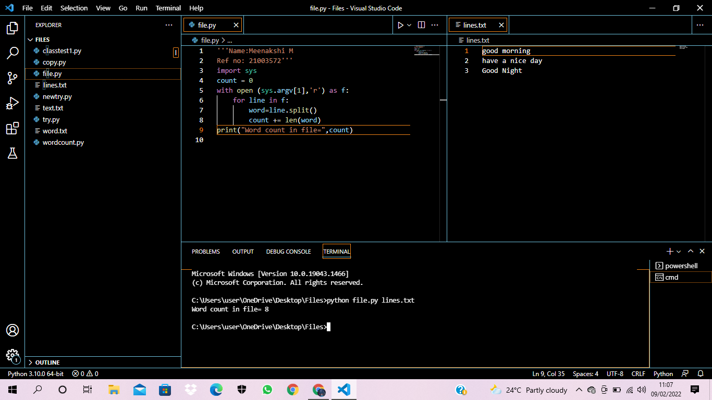

# command-line-arguments-to-count-word
## AIM:
To write a python program for getting the word count from the contents of a file using command line arguments.
## EQUIPEMENT'S REQUIRED: 
PC
Anaconda - Python 3.7
## ALGORITHM: 
### Step 1: import sys.

### Step 2: Open file using open().
 
### Step 3: Use for loop.

### Step 4: Use len to count number of words. 

### Step 5: Give print.
 

## PROGRAM:
```
'''Name:Meenakshi M
Ref no: 21003572'''
import sys
count = 0 
with open (sys.argv[1],'r') as f:
    for line in f:
        word=line.split()
        count += len(word)
print("Word count in file=",count)
```
### OUTPUT:


## RESULT:
Thus the program is written to find the word count from the contents of a file using command line arguments.
